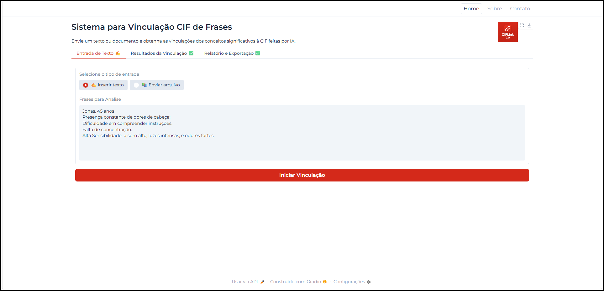
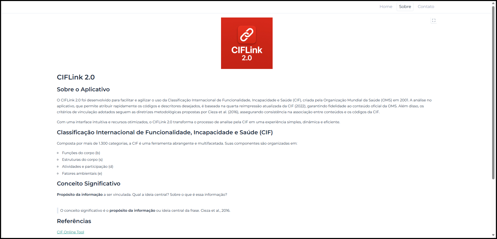
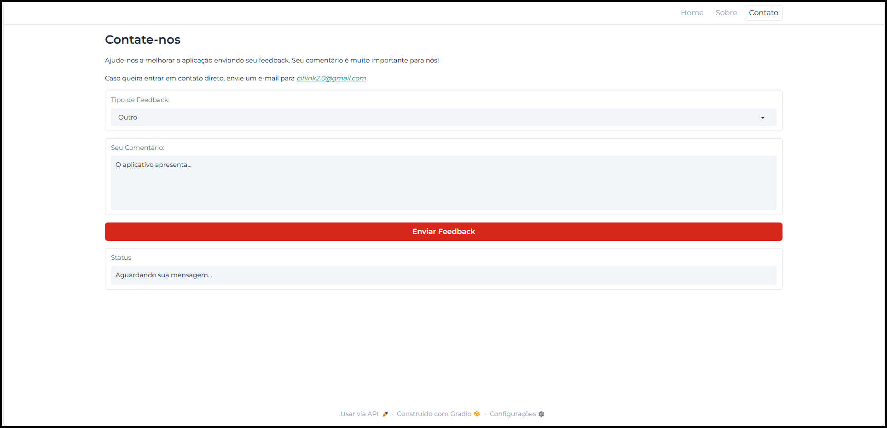

# pages/

Páginas do aplicativo. O conceito geral é dividir a lógica de cada página em:

- `view.py`: Elementos visuais e sua lógica de mudança de estado.
- `strings.py`: Textos utilizados. Seu isolamento facilita manutenção e permite adaptações de idiomas (futuras).
- `scripts.py`: Lógica menor para comportamento da página entre seus componentes e códigos mais robustos em utils.

São páginas:

`main`: Página principal, trata do envio de textos, recebimento da resposta da IA e relatório da vinculação gerada.

`about`: Página que aborda a Classificação Internacional de Funcionalidade, Incapacidade e Saúde (CIF) e a proposta do projeto.

`feedback`: Página responsável por receber comentários e armazená-los em uma planilha google para análise.

